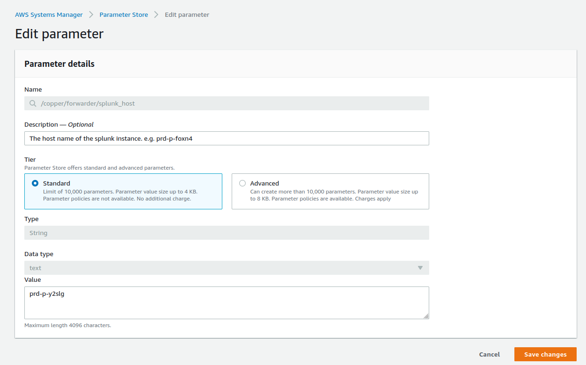

# Copper Interface

This repository contains infrastructure as code to quickly get started with the Copper API.

It can be deployed using the AWS CDK, from your command line.

## Getting Started

### Prerequisites

- npm, Node.js
- Python
- AWS Account
- AWS CLI Access
- AWS CDK
- Splunk [HEC Endpoint](https://docs.splunk.com/Documentation/Splunk/latest/Data/UsetheHTTPEventCollector)

### Quick Start

1. Clone this repository onto your local machine.

    `git clone git@github.com:arctype-dev/copper-interface.git`

2. Change into the directory.

    `cd copper-interface`

3. Bootstrap the CDK. This creates a stack with the resources required to deploy a stack via the CDK. You can see the stack in CloudFormation.

    `cdk bootstrap`

4. Deploy the stack. This creates the resources in your AWS account. You can see the stack in CloudFormation.

    `cdk deploy`

5. Update the SSM parameters with your Splunk configuration.
    In your AWS console, go to Systems Manager > Parameter Store. You should see two parameters that were created by the stack. Update the values with your Splunk configuration.
    

    Edit each parameter and update the values.

    

6. Drop files into the bucket.
7. If you'd like to delete the resources you created:

    `cdk destroy`

## Resources

This stack creates resources that will enable you to drop logs into a bucket, and have the reduced version sent to Splunk.

### Log Bucket

The stack includes a single bucket to drop logs into. Simply upload a file with you logs in the json, csv, or clf format. This bucket is NOT for long term storage, the files are deleted once they are processed by the forwarder lambda.

#### Lambda Event Notification

The bucket is configured to send an event notification to a lambda function when a file is dropped into the bucket. This will trigger the lambda to pull the file from the bucket and send it to Copper for processing along with your Splunk configuration parameters.

### Splunk Data in Systems Manager Parameter Store

The stack initializes two parameters that you need to update with your own values. The first is `splunk_host` which is the hostname of your Splunk instance (e.g. 'prd-p-foxn4'). The second is `splunk_hec_token` which is the Authorization token for a Splunk HEC endpoint that you created.

### Forwarder Lambda

The stack creates a lambda function that will be triggered by the bucket. The lambda function will take the file that was dropped into the bucket, and send it to Splunk. Then, it will delete the file from the bucket.

#### Policies

The lambda function is given a policy to read from SSM Parameter Store within the folder `/copper/logslash/*`
